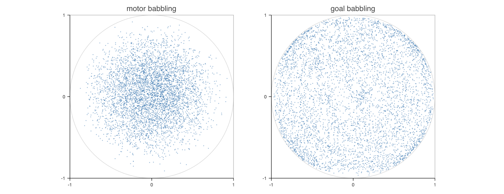

# Recode: Goal Babbling
<p align="right"><a href="http://mybinder.org/repo/benureau/recode/benureau2015_gb/benureau2015_gb.ipynb">run online</a> | <a href="http://fabien.benureau.com/recode/benureau2015_gb/benureau2015_gb.html">html</a> | <a href="https://github.com/benureau/recode/tree/master/benureau2015_gb">github</a> | <a href="https://dx.doi.org/10.6084/m9.figshare.3081352">10.6084/m9.figshare.3081352</a></p>



Beside the code here, you can access:

* a [html version](http://fabien.benureau.com/recode/benureau2015_gb/benureau2015_gb.html), with precomputed outputs.
* an [online interactive version](http://mybinder.org/repo/benureau/recode/benureau2015_gb/benureau2015_gb.ipynb), powered by the [binder service](http://mybinder.org).
* a citable version on [figshare](https://figshare.com) (doi:[10.6084/m9.figshare.3081352](https://dx.doi.org/10.6084/m9.figshare.3081352))

This notebook proposes a general introduction to *goal babbling*, and how it differs from *motor babbling*, in the context of robotics. Goal babbling is a way for robots to discover their body and environment on their own. While representations of those could be pre-programmed, there are many reasons not to do so: environments change, robotic bodies are becoming more complex, and flexible limbs, for instance, are difficult and expensive to simulate. By allowing robots to discover the world by themselves, we use the world itself—the best physic engine we know—for robots to conduct their own experiments, and observe and learn the consequence of their actions, much like infants do on their way to becoming adults.

This notebook requires no previous knowledge beyond some elementary trigonometry and a basic grasp of the Python language. The spirit behind this notebook is to show *all the code* of the algorithms in a *simple* manner, without relying on any library beyond [numpy](http://www.numpy.org/) (and even, just a very little of it). Only the plotting routines, using the [bokeh](http://bokeh.pydata.org/) library, have been abstracted away in the [graphs.py](https://github.com/benureau/recode/blob/master/benureau2015_gb/graphs.py) file.


## Installing Locally

The code depends on the [numpy](http://www.numpy.org/), and the [bokeh](http://bokeh.pydata.org) plotting library for the figures, and you will need [jupyter](http://jupyter.org/) to open the .ipynb file. You can optionally install the [learners](http://github.com/benureau/learners) library to speed-up nearest neighbors computations. In a terminal:

```
git clone http://github.com/benureau/recode
cd recode/benureau2015_gb
pip install -r requirements.txt
jupyter-notebook benureau2015_gb.ipynb
```
